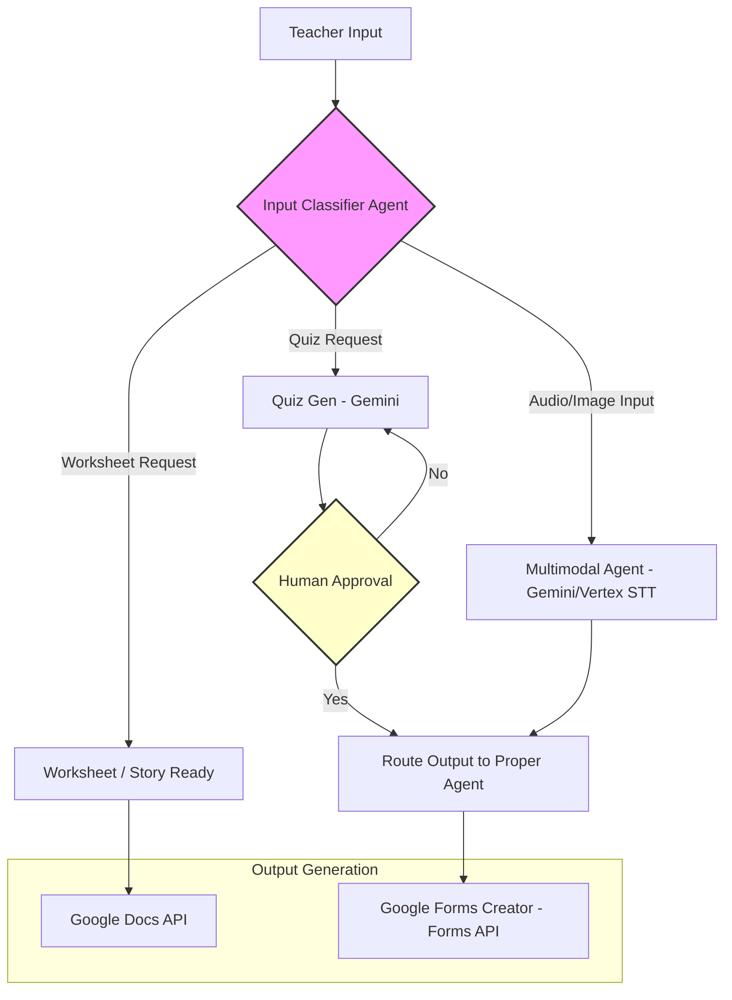

# AgenticAI
Tracks the code and content of the Agentic AI courses
# Flow diagram

```mermaid
graph TD
    A[Teacher Input] --> B{Input Classifier Agent};
    B -- Worksheet Request --> C[Worksheet / Story Ready];
    B -- Quiz Request --> D[Quiz Gen - Gemini];
    B -- Audio/Image Input --> E[Multimodal Agent - Gemini/Vertex STT];
    C --> F[Google Docs API];
    D --> G{Human Approval};
    G -- Yes --> H[Route Output to Proper Agent];
    G -- No --> D;
    E --> H;
    H --> I[Google Forms Creator - Forms API];

    subgraph "Output Generation"
        F
        I
    end

    style B fill:#f9f,stroke:#333,stroke-width:2px
    style G fill:#ffc,stroke:#333,stroke-width:2px
```

# Approach 3

```mermaid

graph TB
    %% External Inputs
    Teacher["Teacher Input"]
    Student["Student Input"]
    
    %% Supervisor Agent (Central Orchestrator)
    Supervisor["Supervisor Agent\nIntent Detection & Routing"]
    
    %% Core Infrastructure
    subgraph "Google Cloud Infrastructure"
        Workflows["Google Cloud Workflows\nOrchestration"]
        PubSub["Google Cloud Pub/Sub\nEvent Messaging"]
        VertexAI["Vertex AI\nRouting & ML Models"]
    end
    
    %% Specialized Agents
    subgraph "Content Generation Agent"
        ContentAgent["Content Generation Agent"]
        ContentTools["Tools:\n• Gemini 1.5 Pro/Ultra\n• PaLM 2 API\n• Google Translate API"]
    end
    
    subgraph "Multimodal Processing Agent"
        MultimodalAgent["Multimodal Processing Agent"]
        MultimodalTools["Tools:\n• Gemini 1.5 Vision API\n• Document AI (OCR)\n• Vertex AI"]
    end
    
    subgraph "Visual Aids Agent"
        VisualAgent["Visual Aids Agent"]
        VisualTools["Tools:\n• Imagen 2\n• Gemini API\n• Google Charts API"]
    end
    
    subgraph "Voice & Assessment Agent"
        VoiceAgent["Voice & Assessment Agent"]
        VoiceTools["Tools:\n• Speech-to-Text API\n• Text-to-Speech API\n• Gemini API"]
    end
    
    subgraph "Educational Game & Planner Agent"
        PlannerAgent["Educational Game & Planner Agent"]
        PlannerTools["Tools:\n• Gemini API\n• Google Calendar API\n• Vertex AI"]
    end
    
    %% Outputs
    subgraph "Outputs"
        Stories["Stories & Examples"]
        Worksheets["Worksheets"]
        Diagrams["Visual Diagrams"]
        Audio["Audio Content"]
        Games["Educational Games"]
        LessonPlans["Lesson Plans"]
    end
    
    %% Flow Connections
    Teacher --> Supervisor
    Student --> Supervisor
    
    Supervisor --> Workflows
    Workflows --> PubSub
    PubSub --> VertexAI
    
    %% Intent-based routing
    Supervisor -->|Content Intent| ContentAgent
    Supervisor -->|Image/Upload Intent| MultimodalAgent
    Supervisor -->|Visual Aid Intent| VisualAgent
    Supervisor -->|Audio Intent| VoiceAgent
    Supervisor -->|Planner Intent| PlannerAgent
    
    %% Tool connections
    ContentAgent --> ContentTools
    MultimodalAgent --> MultimodalTools
    VisualAgent --> VisualTools
    VoiceAgent --> VoiceTools
    PlannerAgent --> PlannerTools
    
    %% Output generation
    ContentAgent --> Stories
    MultimodalAgent --> Worksheets
    VisualAgent --> Diagrams
    VoiceAgent --> Audio
    PlannerAgent --> Games
    PlannerAgent --> LessonPlans
    
    %% Inter-agent communication via Pub/Sub
    ContentAgent -.->|Events| PubSub
    MultimodalAgent -.->|Events| PubSub
    VisualAgent -.->|Events| PubSub
    VoiceAgent -.->|Events| PubSub
    PlannerAgent -.->|Events| PubSub
    
    %% Feedback loops
    Audio -.->|Reading Assessment| VoiceAgent
    Worksheets -.->|Grade Level Adaptation| MultimodalAgent
    Games -.->|Performance Data| PlannerAgent
    
    %% Styling
    classDef agent fill:#e1f5fe,stroke:#0277bd,stroke-width:2px
    classDef tools fill:#f3e5f5,stroke:#7b1fa2,stroke-width:2px
    classDef infra fill:#e8f5e8,stroke:#2e7d32,stroke-width:2px
    classDef output fill:#fff3e0,stroke:#f57c00,stroke-width:2px
    classDef input fill:#fce4ec,stroke:#c2185b,stroke-width:2px
    
    class Supervisor,ContentAgent,MultimodalAgent,VisualAgent,VoiceAgent,PlannerAgent agent
    class ContentTools,MultimodalTools,VisualTools,VoiceTools,PlannerTools tools
    class Workflows,PubSub,VertexAI infra
    class Stories,Worksheets,Diagrams,Audio,Games,LessonPlans output
    class Teacher,Student input
```

