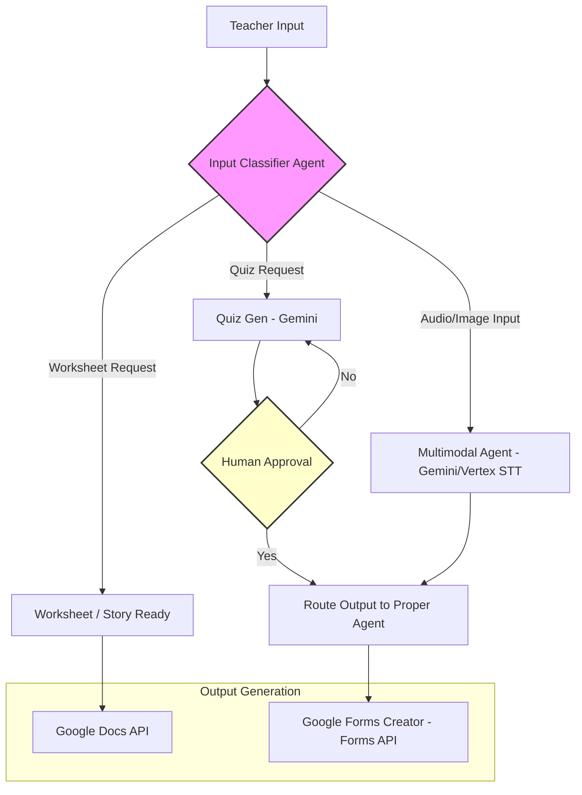

# AgenticAI
Tracks the code and content of the Agentic AI courses that I'm currently learning

# Flow diagram

```mermaid
graph TD
    A[Teacher Input] --> B{Input Classifier Agent};
    B -- Worksheet Request --> C[Worksheet / Story Ready];
    B -- Quiz Request --> D[Quiz Gen - Gemini];
    B -- Audio/Image Input --> E[Multimodal Agent - Gemini/Vertex STT];
    C --> F[Google Docs API];
    D --> G{Human Approval};
    G -- Yes --> H[Route Output to Proper Agent];
    G -- No --> D;
    E --> H;
    H --> I[Google Forms Creator - Forms API];

    subgraph "Output Generation"
        F
        I
    end

    style B fill:#f9f,stroke:#333,stroke-width:2px
    style G fill:#ffc,stroke:#333,stroke-width:2px
```

# Approach 2

```mermaid

graph TD
    A[Teacher Input] --> B{Supervisor Agent}

    B --> C[Content Generation Agent]
    C --> C1[Stories, Localized Examples, Analogies, Lesson Plans]
    C1 --> H[Output to Teacher]

    B --> D[Multimodal Processing Agent]
    D --> D1[Extracts Text/Images, Creates Worksheets]
    D1 --> H

    B --> E[Visual Aids Agent]
    E --> E1[Blackboard-Friendly Drawings, Diagrams, Charts/Graphs]
    E1 --> H

    B --> F[Voice & Assessment Agent]
    F --> F1[Evaluates Pronunciation & Fluency, Reads Content Aloud]
    F1 --> H

    B --> G[Educational Game & Planner Agent]
    G --> G1[Educational Mini-Games, Weekly Lesson Plans]
    G1 --> H

    subgraph Supervisor Agent
        B --> B_GW(Google Cloud Workflows)
        B --> B_PS(Google Cloud Pub/Sub)
        B --> B_VA(Vertex AI)
    end

    subgraph Content Generation Agent
        C --> C_G15P(Gemini 1.5 Pro / Ultra API)
        C --> C_P2(PaLM 2 API)
        C --> C_GT(Google Translate API)
    end

    subgraph Multimodal Processing Agent
        D --> D_G15V(Gemini 1.5 Vision API)
        D --> D_DAI(Document AI)
        D --> D_VA(Vertex AI)
    end

    subgraph Visual Aids Agent
        E --> E_I2(Imagen 2 via Vertex AI)
        E --> E_G(Gemini API)
        E --> E_GC(Google Charts API)
    end

    subgraph Voice & Assessment Agent
        F --> F_GSTT(Google Cloud Speech-to-Text API)
        F --> F_GTTS(Google Cloud Text-to-Speech API)
        F --> F_G(Gemini API)
    end

    subgraph Educational Game & Planner Agent
        G --> G_G(Gemini API)
        G --> G_GCAL(Google Calendar API)
        G --> G_VA(Vertex AI)
    end
```
